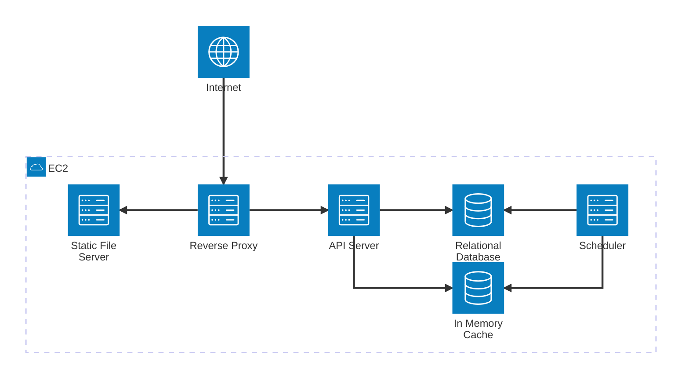
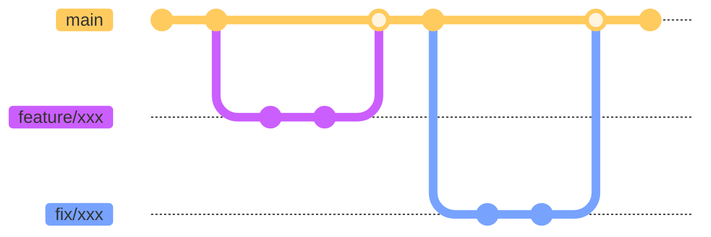

# TradeSmartly

<p align="center">
  
</p>

     

## 🔍 Overview

### Architecture



### Branches



### Tech Stack

- API Server
  - Programming Language: Python
  - Framework: Django
- Frontend
  - Programming Language: TypeScript
  - Framework: React
- Database: PostgreSQL
- Cache: Redis
- Reverse Proxy: Nginx
- Scheduler
  - Programming Language: Python

## 🧑🏻‍💻 Development

### Prerequisites

- Operating System: MacOS or Linux
- Git (>=2.34.0)
- GNU Make (>=3.81.0)
- Docker (>=27.4.0)
- Visual Studio Code (or any other editor that supports devcontainer)

### Setup

- Step 0: Clone the repository

  ```bash
  git clone git@github.com:bingyangchen/trade-smartly.git
  cd trade-smartly
  ```

- Step 1: Create .env file

  ```bash
  cp example.env .env
  ```

  Fill in the values for the environment variables.

- Step 2: Build the images for development

  ```bash
  make build-dev
  ```

- Step 3: Install Git hooks

  ```bash
  make install-git-hooks
  ```

  This command will add some essential scripts into the .git/hooks/ directory.

- Step 4: Generate SSL certificates and keys for development

  ```bash
  make cert-dev
  ```

- Step 5: Run the Development Server

  ```bash
  make start
  ```

### Stop the Development Server

```bash
make stop
```

### The Development Workflow

- **Step 1:** Create a branch from `main`, naming it `feature/xxx` or `hotfix/xxx`.
- **Step 2:** Complete your work, then commit and push your changes.
- **Step 3:** Open a pull request on GitHub and obtain approval for your PR.
- **Step 4:** Merge your branch into `main`.
- **Step 5:** Build new images for **production** from the latest `main` on your local machine.
- **Step 6:** Push the new images to Docker Hub.
- **Step 7:** SSH into the EC2 instance, pull the latest code and images.
- **Step 8:** Restart all Docker containers. You're done!

### Add/Remove a Dependency

Let's dive deeper into the details of **Step 2** of the development workflow when you need to add or remove a dependency:

#### API Server

- **Step 2-1:** Enter the shell of the API server container.
- **Step 2-2:** Install/Remove the dependency: `poetry add {DEPENDENCY} --lock` or `poetry remove {DEPENDENCY} --lock`
  - Note: The `--lock` flag prevents the download of the dependency, only version check will be performed.
- **Step 2-3:** Exit the shell and build the images for development.
- **Step 2-4:** Restart all Docker containers.

#### Frontend

- **Step 2-1:** Enter the shell of the frontend container.
- **Step 2-2:** Install/Remove the dependency: `npm install {DEPENDENCY} --save` or `npm remove {DEPENDENCY} --save`
- **Step 2-3:** Exit the shell and build the images for development.
- **Step 2-4:** Restart all Docker containers.

## 🚀 Production

### Prerequisites

- Operating System: Linux (Ubuntu >=22.04)
- Domain name: taigu.tw
- Git (>=2.34.0)
- GNU Make (>=3.81.0)
- Docker (>=27.4.0)

### Setup

```bash
git clone git@github.com:bingyangchen/trade-smartly.git
cd ~/trade-smartly
cp example.env .env

# [ACTION REQUIRED] Update ~/trade-smartly/.env

make cert-prod
sudo usermod -aG docker $USER
newgrp docker
make pull-images-prod
sudo timedatectl set-timezone Asia/Taipei
make start

# Restore the database from the backup:
docker cp ~/db-backups/backup.sql trade-smartly-db-1:/backup.sql
make shell-db
    # In the db container:
    psql trade_smartly < /backup.sql
    exit
```
